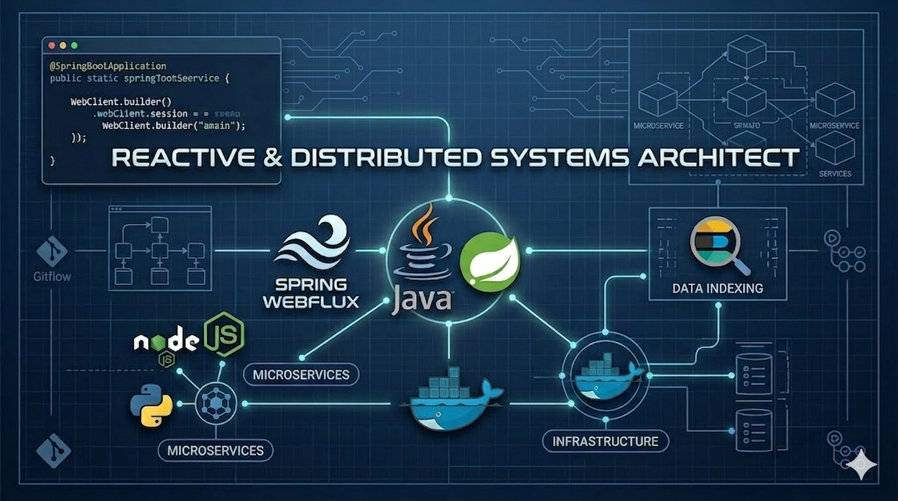

## Perfil Overview

## Technologies & Tools

### Desenvolvimento Backend & APIs
-  **Java Eco:** Spring Boot e WebFlux para sistemas reativos e de alta performance.
-   **Node.js & Python:** Construção de microserviços escaláveis com TypeScript, FastAPI e Django.
  - **Arquitetura:** Implementação de padrões RESTful, Clean Architecture e princípios SOLID.

### Dados & Persistência
-  **SQL & NoSQL:** Modelagem em PostgreSQL e experiência com DBMaker.
-  **Busca & Performance:** Implementação de busca indexada e análise de dados com Elasticsearch.
-  **Estratégias de Cache & Performance:** Arquitetura *Cache Aside* com Redis e PostgreSQL para dados de alta volatilidade e tempo real (como dashboards de preços). Redução drástica de latência (escala de microssegundos) via tratamento eficiente de *Cache Hit* / *Cache Miss* e invalidação inteligente de chaves.

### DevOps & Ferramental
-  **Containerização:** Orquestração de ambientes de desenvolvimento e produção com Docker.
-  **CI/CD & Versionamento:** Fluxos de trabalho avançados em Git/GitHub (Gitflow, Code Review e Actions).

### Data Apps & Interface
- 🎈 **Visualização:** Desenvolvimento de dashboards e ferramentas internas utilizando Streamlit.

---

## Featured Project

###  [CryptoSentinel](https://github.com/Matos-0/CryptoSentinel)

Sistema de monitoramento reativo de criptomoedas desenvolvido com **Java 21** e **Spring Boot 3**.

- **WebStack:** Spring WebFlux (Programação Reativa)
- **Data:** Spring Data Elasticsearch
- **Ingestão:** Integração em tempo real com a API **CoinGecko** via WebClient
- **Infra:** Docker & Docker Compose para orquestração de serviços
##  Distros

-  Debian  
-  Ubuntu  
-  Windows  

##  Currently Studying

> [PT] Sou desenvolvedor com foco em backend e estou atualmente ampliando meu stack com estudos em Python e Java, além de aprofundar meus conhecimentos em arquitetura de software. Busco evoluir na construção de sistemas robustos, escaláveis e bem estruturados, aplicando boas práticas de desenvolvimento e padrões arquiteturais que promovam manutenibilidade e performance.

> [EN] I’m a developer focused on backend and currently expanding my tech stack through studies in Python and Java, while deepening my knowledge in software architecture. I aim to grow in building robust, scalable, and well-structured systems, applying best development practices and architectural patterns that promote maintainability and performance.

## 📊 GitHub Stats

## 📫 Contact

- 📧 **Gmail**: [gmmatosdev@gmail.com](mailto:gmmatosdev@gmail.com)  
- 💼 **LinkedIn**: [Gabriel Matos](https://www.linkedin.com/in/gabriel-matos/)

